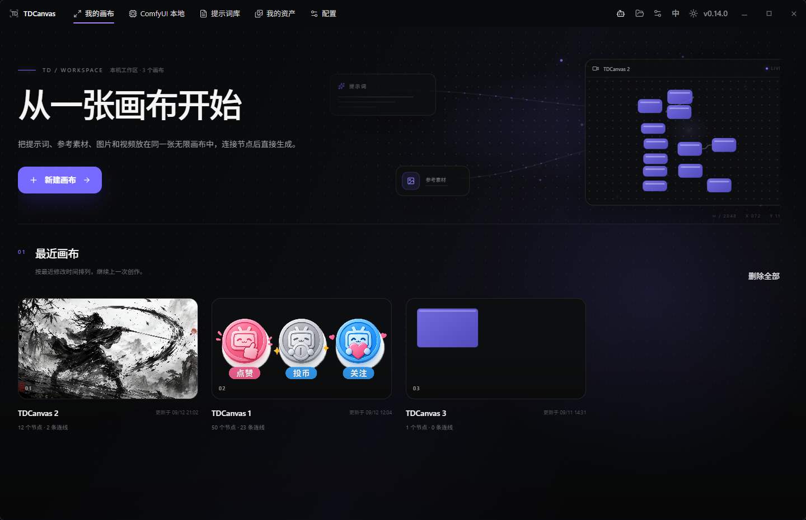
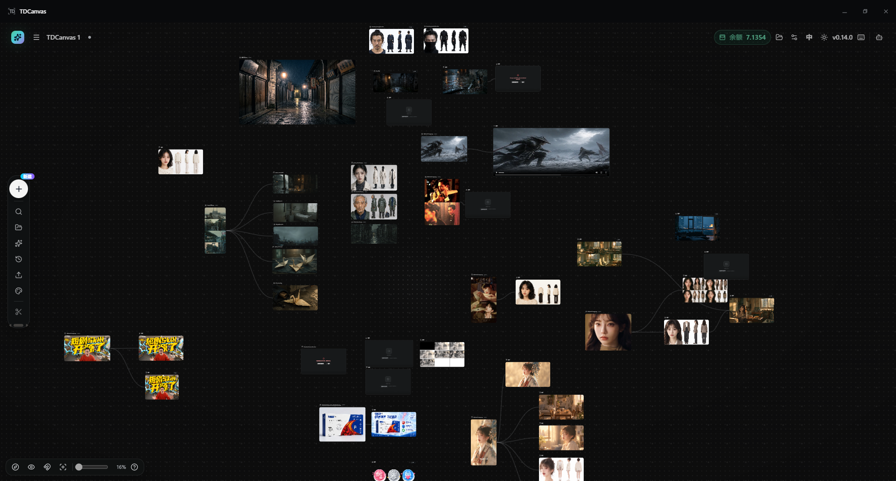
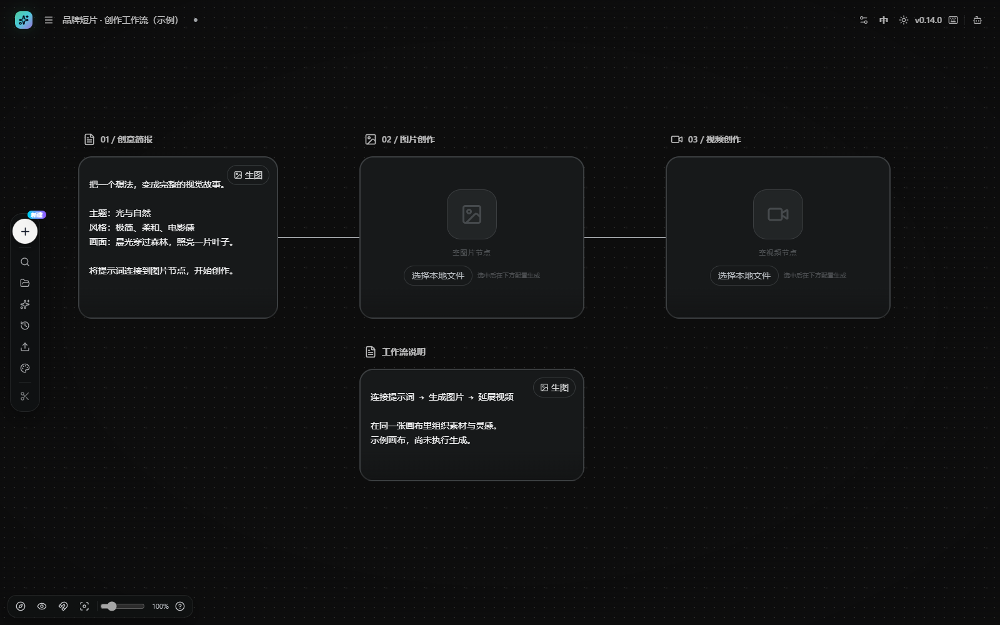
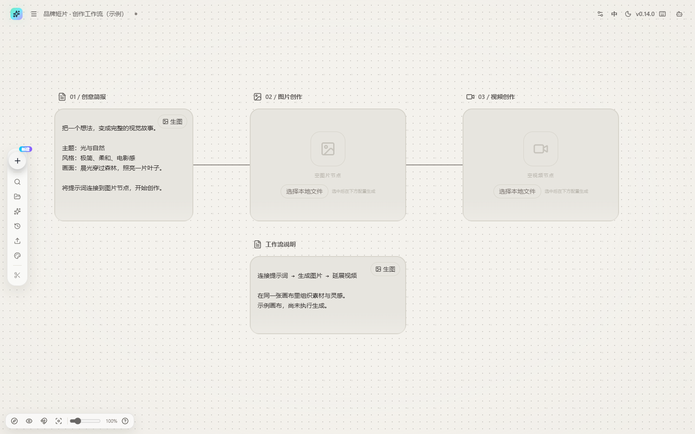
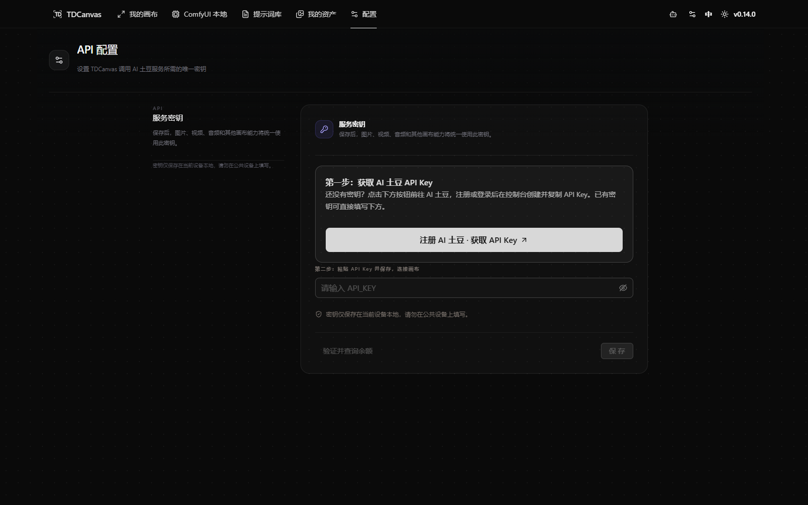

> **先连接 AI 土豆 API，开始画布创作与二次开发**
>
> **[注册 AI 土豆 · 获取 API Key →](https://api.aitudou.net/)**
>
> 注册或登录后，在控制台创建并复制 API Key。启动 TDCanvas，打开右上角设置，粘贴密钥并保存，即可连接 AI 土豆的图片、视频、音频等画布生成能力。
>
> **二次开发推荐接入 AI 土豆 API**：复用本项目 `web/src/services/api/` 中的 Aitudou 接口封装，扩展画布节点与生成工作流。服务入口：[AI 土豆 API](https://api.aitudou.net/)；接入步骤：[快速开始](docs/content/docs/overview/quick-start.zh-CN.mdx)。生成调用按平台实际计费。

<p align="center">
  
</p>

<h1 align="center">TDCanvas</h1>

<p align="center">TDTV 打造的 AI 无限画布</p>

TDCanvas 将画布编排、节点连接、AI 生成、素材管理和本地 Agent 协作集中在同一个工作空间。应用打开后直接进入无限画布，不再经过独立展示首页；图片与视频能力通过画布节点按需使用，不再提供单独的生图工作台或视频创作台。

## 产品展示

以下展示桌面客户端的项目管理、创作画布与 API 接入界面。

**我的画布 · 管理项目，预览最近创作**



**创作全景 · 角色、场景、图片与视频集中编排**



以下深浅主题截图使用示例节点，未执行生成。

**深色画布 · 从提示词到图片与视频的节点编排**



**浅色画布 · 同一工作流，自由切换主题**



**API 接入 · 注册获取密钥，粘贴保存即可连接**



## 桌面客户端源码启动

环境要求：Node.js 20+、Rust 1.85+。Windows 需要 Microsoft C++ Build Tools 与 WebView2；macOS 需要 Xcode Command Line Tools。

```bash
cd web
npm install --legacy-peer-deps
npm run desktop:dev
```

启动后会直接打开 TDCanvas 桌面窗口，不需要浏览器。`npm run dev` 仅保留给前端界面调试，不是正式用户入口。

## 打包 Windows / macOS

```bash
cd web
npm run desktop:package
```

脚本会询问打包 Windows、macOS 或全部版本。Windows 本机生成 NSIS `.exe`；Mac 本机生成 Intel + Apple Silicon 通用 `.app/.dmg`；“全部”会交给仓库的双平台 GitHub Actions 构建，因为正式 macOS 安装包不能在 Windows 本机生成。

首次使用时请在设置中填写自己的 AI 土豆 API Key 并保存，随后在画布节点中选择模型。仓库不包含用户密钥。

## 主要能力

- 无限画布：节点拖拽、缩放、连线、小地图、撤销重做和项目导入导出。
- 画布内 AI 工作流：在节点上下文中组织提示词、参考素材与生成结果。
- 素材管理：上传素材保存在客户端本地；Aitudou 生成的图片、视频、音频和文件会自动保存到系统应用数据目录并复用稳定本地地址。
- TDCanvas Agent：可选的本地 Agent 通道，用于让 Codex 或 Claude Code 读取和操作当前画布。
- 插件扩展：通过节点插件扩展画布能力；仅应安装来自可信来源的插件。

## ComfyUI 本地画布插件

**推荐使用土豆 ComfyUI 整合包，将本地工作流接入 TDCanvas，封装为可连线、可复用的画布插件节点。**

> **[下载土豆 ComfyUI 纯净整合包（无模型，包含启动器）→](https://pan.quark.cn/s/d96c1eb34170)**
>
> 纯净包不包含模型，请按所用工作流准备模型及所需自定义节点。

1. 下载并解压整合包，按工作流需要配置模型与自定义节点。
2. 在 TDCanvas 的「ComfyUI 本地」中选择整合包的 ComfyUI 环境目录并启动环境。
3. 导入 ComfyUI **API Format JSON** 工作流，检查依赖，选择要暴露的输入与输出并保存。
4. 将工作流添加到画布，作为插件节点连接提示词、图片等输入，在画布中运行并查看结果。

更多说明见 [ComfyUI 本地模块](modules/comfyui-local/README.md)。

## 数据与配置

画布项目、上传素材、生成记录和连接配置默认保存在 TDCanvas 客户端本地。Aitudou 生成结果会在任务完成后立即转存到系统应用数据目录：Windows 为 `%LOCALAPPDATA%/com.tdtv.tdcanvas/media-cache`，macOS 为 `~/Library/Application Support/com.tdtv.tdcanvas/media-cache`。API 密钥保存在当前客户端配置中，请只在受信任的设备上使用。

## 文档

- [快速开始](docs/content/docs/overview/quick-start.zh-CN.mdx)
- [画布节点操作手册](docs/content/docs/canvas/canvas-node-manual.zh-CN.mdx)
- [画布快捷键](docs/content/docs/canvas/canvas-shortcuts.zh-CN.mdx)
- [安全策略](SECURITY.md)
- [贡献者协议](CLA.md)

## 开源许可与来源

TDCanvas 基于 `basketikun/infinite-canvas` 开源项目进行二次开发。
